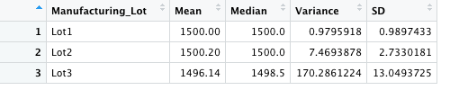
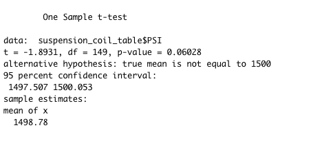
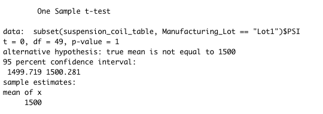
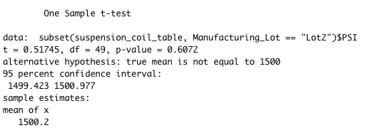
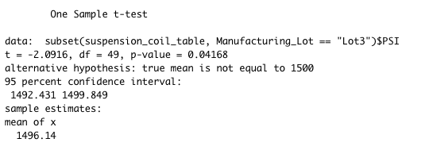

# MechaCar_Statistical_Analysis

## Linear Regression to Predict MPG

This is a linear model that predicts the mpg of MechaCar prototypes using several variables such as vehicle length, vehicle weight, spoiler angle, ground clearance and AWD.

- Vehicle length and ground clearance provided a non-random amount of variance to the mpg values in the dataset.
- The slope of the linear model is not considered to be zero because the p-value of the linear model was much smaller than the significance level, which shows that the null hypothesis is not true.
- R-squared is .7149, which is a strong correlation for the dataset and shows the dataset is 71% accurate.

## Summary Statistics on Suspension Coils

As shown above in total summary Data, overall variance is 62.29 which is under limit of 100 pounds per square inch. While in lot summary stats, Variance for Lot 3 exceeded 100 pounds per square inch and doesn't meet the design specifications.

## T-Tests on Suspension Coils

### T-test for all Lots

A review of the results of the T-test for the suspension coils across all manufacturing lots shows that they are not statistically different from the population mean, and the p-value of 1 is higher for us to reject the null hypothesis.

### T-test for all Lot 1

For manufacturing Lot 1, it shows that calculated p-value of 1 is higher for us to reject the null hypothesis.

### T-test for all Lot 2

For manufacturing Lot 2, it shows that calculated p-value (0.6072) is not low enough for us to reject the null hypothesis.

### T-test for all Lot 3

For manufacturing Lot 3, it shows that calculated p-value is just low enough (0.04168) for us to reject the null hypothesis. This lot may be need to be discarded, or at least more closely evaluated.

## Study Design: MechaCar vs Competition

- A statistical study to compare the MechaCar against its competition in various other categories such as cost, horse power, safety rating, maintenance cost or highway fuel efficiency.
- In case of highway fuel efficiency as metric, null hypothesis would be that there is no statistical difference between the fuel efficiency of the MechaCar prototype and its competitors. And, the alternative hypotheses would be that there is a statistical difference between the fuel efficiency of the MechaCar prototype and its competitors.
- We could use a one-way ANOVA test to test the hypothesis. It is used to compare the means of a continuous numerical variable across a number of groups (or factors in R).
- We could use aov() method to run the ANOVA test and summary() function to retrieve the summary statistics. If the p-value resulted in a value below 0.05 we would have sufficient statistical reasoning to reject the null hypotheses.
